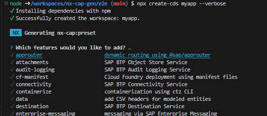

# Bootstrap SAP CAP project with one command

This command will initialize a new monorepo for CAP projects

## Usage

It is enough just to run this command

```bash
npx create-cds my-cap-workspace
```

## Command documentation

```
Commands:
  create-cds <name>  create a new CAP(CDS) workspace

CAP project options:
  --name      CAP project name                                          [string]
  --features  Comma-delimited list of features to add to the cap project ( see
              "cds add --help" for more information )                   [string]

Options:
  --version  Show version number                                       [boolean]
  --path     Path (relative to the workspace root) where to create CAP projects
                                                                        [string]
  --help     Show help                                                 [boolean]

```

If features not provided, then interactive screen will be shown:


